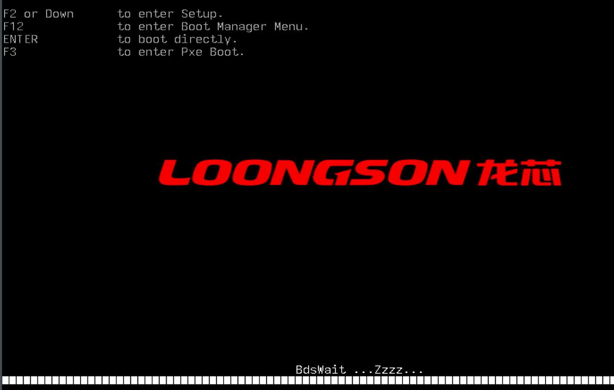
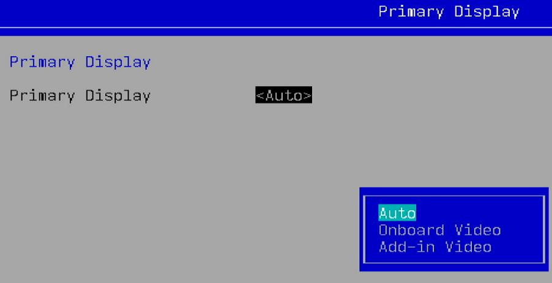
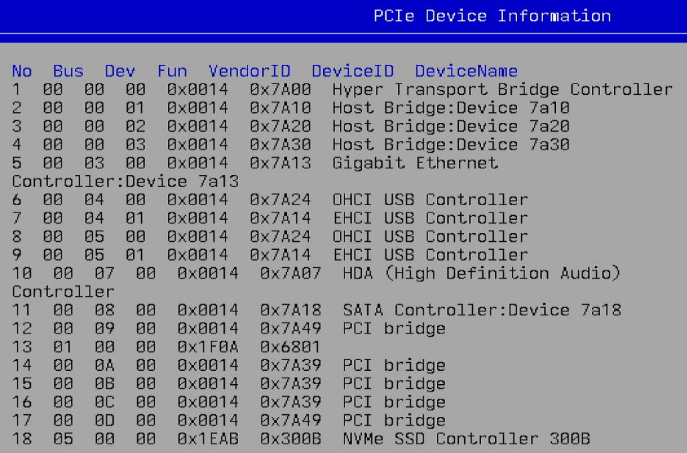
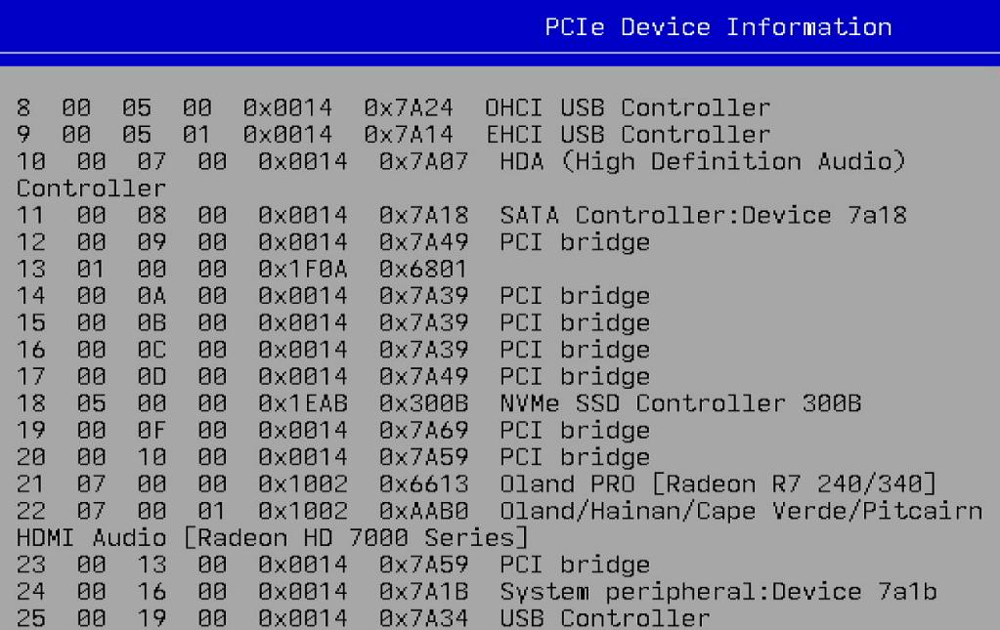
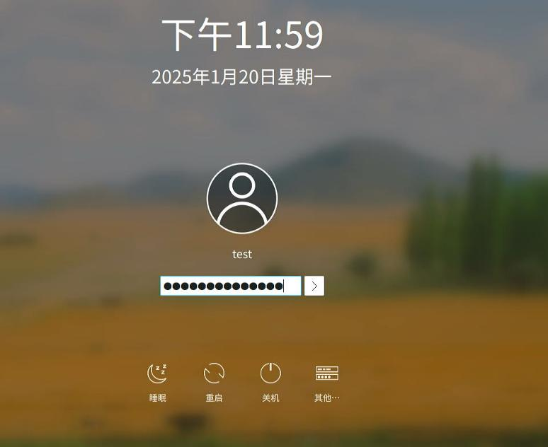

# Loongson 3A6000

### Hardware
Following are some screenshots for Loongson 3A6000.   

Startup Logo:   



System Summary:    


Primary Display:    



PCIe Device Information:   






### System/OS
Login window(Running KDE,sddm):    



System information:    

```
(ssh)test@aosc-9588454d [ ~ ] $ cat /etc/issue
\n - AOSC OS 11.5.2 / Kernel \r (\l)
(ssh)test@aosc-9588454d [ ~ ] $ uname -a
Linux aosc-9588454d 6.10.10-aosc-main #1 SMP PREEMPT_DYNAMIC Fri Sep 13 17:31:45 UTC 2024 loongarch64 GNU/Linux
(ssh)test@aosc-9588454d [ ~ ] $ free -m
               total        used        free      shared  buff/cache   available
内存：         16096        3105       13688          25         852       12991
交换：         15359           0       15359
(ssh)test@aosc-9588454d [ ~ ] $ cat /proc/cpuinfo
system type		: generic-loongson-machine

processor		: 0
package			: 0
core			: 0
global_id		: 0
CPU Family		: Loongson-64bit
Model Name		: Loongson-3A6000-HV
CPU Revision		: 0x00
FPU Revision		: 0x00
CPU MHz			: 2500.00
BogoMIPS		: 5000.00
TLB Entries		: 2112
Address Sizes		: 48 bits physical, 48 bits virtual
ISA			: loongarch32 loongarch64
Features		: cpucfg lam ual fpu lsx lasx crc32 lvz lbt_x86 lbt_arm lbt_mips
Hardware Watchpoint	: yes, iwatch count: 8, dwatch count: 4
```
Driver info:    

```
(ssh)test@aosc-9588454d [ ~ ] $ sudo lspci -vvnn -s 00:07.0  | grep 'in use'
	Kernel driver in use: snd_hda_intel
(ssh)test@aosc-9588454d [ ~ ] $ sudo lspci -vvnn -s 07:00.1 | grep 'in use'
	Kernel driver in use: snd_hda_intel
(ssh)test@aosc-9588454d [ ~ ] $ sudo lspci -vvnn -s 07:00.0 | grep 'in use'
	Kernel driver in use: amdgpu
(ssh)test@aosc-9588454d [ ~ ] $ sudo lspci | grep '07.0'
00:07.0 Audio device: Loongson Technology LLC HDA (High Definition Audio) Controller
07:00.0 VGA compatible controller: Advanced Micro Devices, Inc. [AMD/ATI] Oland PRO [Radeon R7 240/340 / Radeon 520] (rev 83)
07:00.1 Audio device: Advanced Micro Devices, Inc. [AMD/ATI] Oland/Hainan/Cape Verde/Pitcairn HDMI Audio [Radeon HD 7000 Series]
```
### Virtualization
Installed packages:    

```
(ssh)test@aosc-9588454d [ ~ ] $ sudo dpkg -l | grep qemu
ii  canokey-qemu                   0+git20230605                                          loongarch64  Library for Qemu to provide a virtual canokey to the guest OS
ii  qemu                           9.0.1-3                                                loongarch64  A KVM based virtualization client
(ssh)test@aosc-9588454d [ ~ ] $ dpkg -l | grep libvirt
ii  libvirt                        10.5.0                                                 loongarch64  API for controlling virtualization engines
ii  libvirt-glib                   5.0.0                                                  loongarch64  GLib bindings for LibVirt
ii  libvirt-python                 10.5.0                                                 loongarch64  Python bindings for libvirt
(ssh)test@aosc-9588454d [ ~ ] $ dpkg -l | grep virt-manager
ii  virt-manager                   4.1.0-3                                                all          Desktop user interface for managing virtual machines
(ssh)test@aosc-9588454d [ ~ ] $ qemu-system-loongarch64 --version
QEMU emulator version 9.0.1
Copyright (c) 2003-2024 Fabrice Bellard and the QEMU Project developers
```
The virtualization suites are installed via:    

```
$ sudo apt update -y
$ sudo apt install -y virt-manager
$ sudo systemctl enable libvirtd
```
