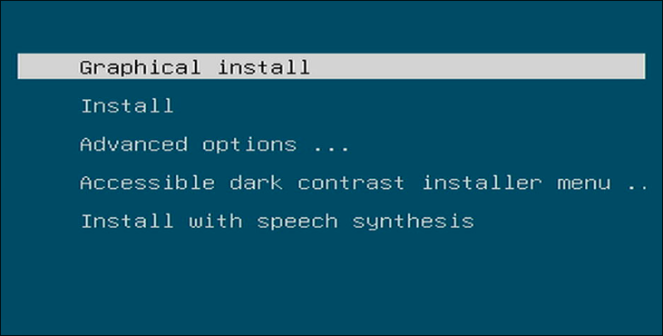
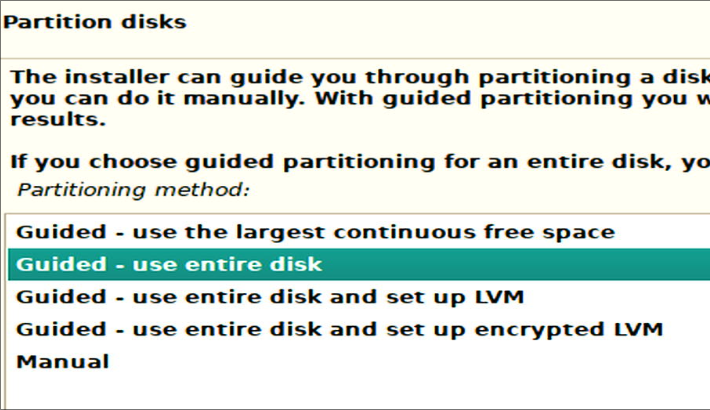
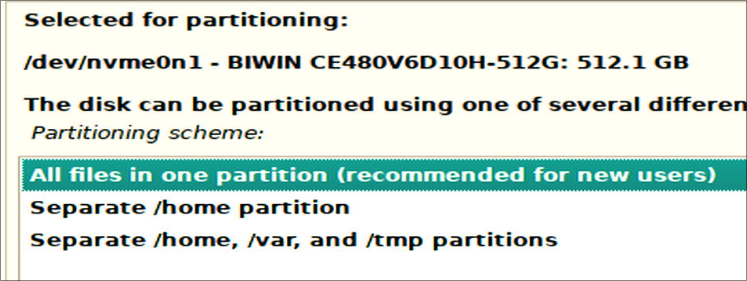
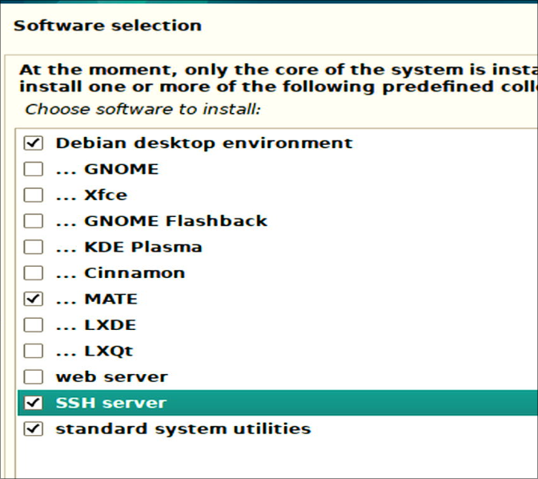
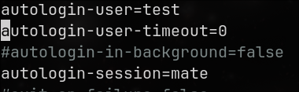
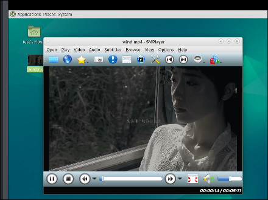
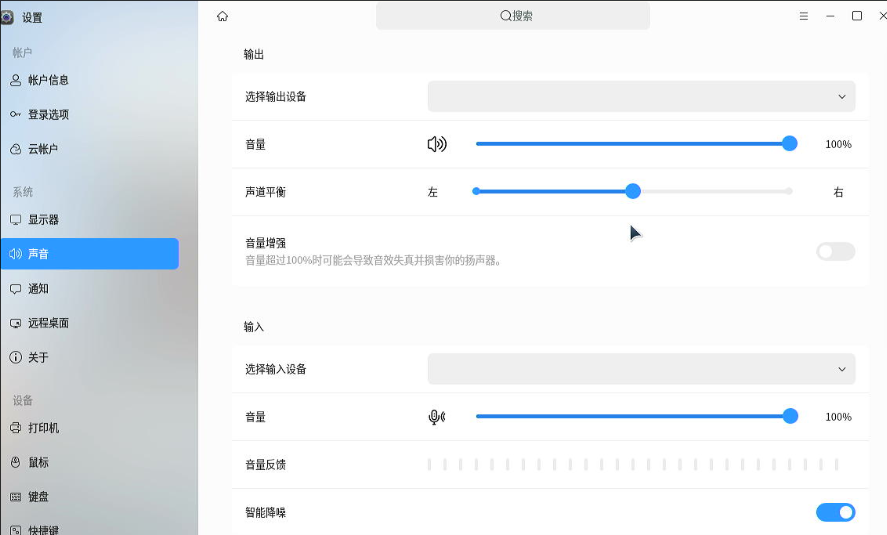
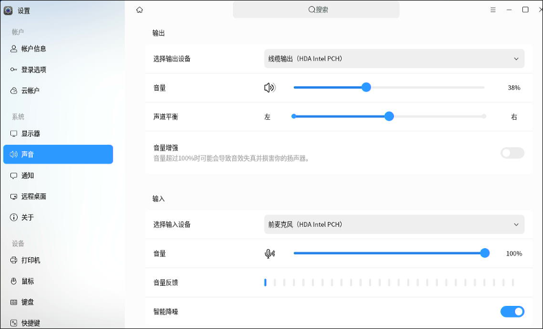

# x86_debian_host_setting
Recording the tips for setting up the x86 based lxc desktop host on Debian.   

### System Installation
The iso is `debian-12.9.0-amd64-DVD-1.iso`.    








Using mate desktop( you could also choose other desktop environments):     




### Software Setting
Edit the apt's sources list:     

```
# cat /etc/apt/sources.list
#deb cdrom:[Debian GNU/Linux 12.9.0 _Bookworm_ - Official amd64 DVD Binary-1 with firmware 20250111-10:55]/ bookworm contrib main non-free-firmware
deb http://mirrors.ustc.edu.cn/debian bookworm main contrib non-free non-free-firmware
# deb-src http://mirrors.ustc.edu.cn/debian bookworm main contrib non-free non-free-firmware
deb http://mirrors.ustc.edu.cn/debian bookworm-updates main contrib non-free non-free-firmware
# deb-src http://mirrors.ustc.edu.cn/debian bookworm-updates main contrib non-free non-free-firmware

# backports 软件源，请按需启用
# deb http://mirrors.ustc.edu.cn/debian bookworm-backports main contrib non-free non-free-firmware
# deb-src http://mirrors.ustc.edu.cn/debian bookworm-backports main contrib non-free non-free-firmware
# apt update -y && apt upgrade -y
```
Install some necessary packages:     

```
apt install -y iotop vim nethogs s-tui libvirt-daemon-driver-lxc virt-manager lxc lxc-templates lxcfs
```
Autologin configuration:     

```
# vim /etc/lightdm/lightdm.conf
```
subuid and subgid configuration:     

```
root@lxcdesktop:~# cat /etc/subuid
test:100000:65536
root:100000:65536
root@lxcdesktop:~# cat /etc/subgid
test:100000:65536
root:100000:65536
```



Reboot the machine now.   
### lxc configuration
Edit the common.conf:    

```
diff /usr/share/lxc/config/common.conf /usr/share/lxc/config/common.conf.bak
40,53d39
< ### tty0, tty1, tty7, tty8
< lxc.cgroup.devices.allow = c 4:0 rwm
< lxc.cgroup.devices.allow = c 4:1 rwm
< lxc.cgroup.devices.allow = c 4:7 rwm
< lxc.cgroup.devices.allow = c 4:8 rwm
< ## graphics. /dev/dri
< lxc.cgroup.devices.allow = c 226:0 rwm
< lxc.cgroup.devices.allow = c 226:128 rwm
< ## graphics. /dev/fb0
< lxc.cgroup.devices.allow = c 29:0 rwm
< ### sound
< lxc.cgroup.devices.allow = c 116:* rwm
< ### input
< lxc.cgroup.devices.allow = c 13:* rwm
89,104d74
< ## graphics. /dev/dri
< lxc.cgroup2.devices.allow = c 226:0 rwm
< lxc.cgroup2.devices.allow = c 226:128 rwm
< ## graphics. /dev/fb0
< lxc.cgroup2.devices.allow = c 29:0 rwm
< ## graphics. /dev/fb1
< #lxc.cgroup2.devices.allow = c 29:1 rwm
< ## tty0, 1, 7, 8
< lxc.cgroup2.devices.allow = c 4:0 rwm
< lxc.cgroup2.devices.allow = c 4:1 rwm
< lxc.cgroup2.devices.allow = c 4:7 rwm
< lxc.cgroup2.devices.allow = c 4:8 rwm
< ### sound
< lxc.cgroup2.devices.allow = c 116:* rwm
< ### input
< lxc.cgroup2.devices.allow = c 13:* rwm
107c77
< lxc.mount.auto = cgroup:mixed proc:rw sys:mixed
---
> lxc.mount.auto = cgroup:mixed proc:mixed sys:mixed
109d78
< lxc.mount.entry = /dev/snd dev/snd none bind,optional,create=dir

```
Edit crontab for setting the privilege:    

```
# crontab -e
@reboot chmod 777 /dev/tty* && chmod 777 /dev/fb* && chmod 777 -R /dev/dri/* && chmod 777 -R /dev/snd/*
```
Create the lxc desktop instance:     

```
# ls
kylinlxc.tar.xz  uoslxcdesktop.tar.xz  zkfdlxc.tar.xz
meta.tar.xz	 uoslxc.tar.xz
# root@lxcdesktop:~# lxc-create -t local -n kylinlxc -- -m /root/meta.tar.xz -f /root/kylinlxc.tar.xz
Unpacking the rootfs

---
You just created an Ubuntu jammy amd64 (20241021_07:42) container.

To enable SSH, run: apt install openssh-server
No default root or user password are set by LXC.
```
Edit the lxc instance's configuration file:     

```
root@lxcdesktop:~# cat //var/lib/lxc/kylinlxc/config
# Template used to create this container: /usr/share/lxc/templates/lxc-local
# Parameters passed to the template: -m /root/meta.tar.xz -f /root/kylinlxc.tar.xz
# For additional config options, please look at lxc.container.conf(5)

# Uncomment the following line to support nesting containers:
#lxc.include = /usr/share/lxc/config/nesting.conf
# (Be aware this has security implications)


# Distribution configuration
lxc.include = /usr/share/lxc/config/common.conf
lxc.arch = linux64

# Container specific configuration
lxc.apparmor.profile = generated
lxc.apparmor.allow_nesting = 1
lxc.rootfs.path = dir:/var/lib/lxc/kylinlxc/rootfs
lxc.uts.name = kylinlxc

# Network configuration
lxc.net.0.type = veth
lxc.net.0.link = lxcbr0
lxc.net.0.flags = up

lxc.mount.entry = /dev/fb0 dev/fb0 none bind,optional,create=file
lxc.mount.entry = /dev/dri dev/dri none bind,optional,create=dir
lxc.mount.entry = /dev/dri/renderD128 dev/dri/renderD128 none bind,optional,create=file
### allow tty8
lxc.mount.entry = /dev/tty7 dev/tty7 none bind,optional,create=file
lxc.mount.entry = /dev/tty8 dev/tty8 none bind,optional,create=file
lxc.mount.entry = /dev/tty0 dev/tty0 none bind,optional,create=file
### allow all of the input
lxc.mount.entry = /dev/input dev/input none bind,optional,create=dir
### allow all of the snd
lxc.mount.entry = /dev/snd dev/snd none bind,optional,create=d
```
Create the `preX-populate-input.sh` for this instance:     

```
root@lxcdesktop:~# cat preX-populate-input.sh
#!/usr/bin/env bash

### Creates config file for X with all currently present input devices
#   after connecting new device restart X (systemctl restart lightdm)
######################################################################

cat >/etc/X11/xorg.conf.d/10-lxc-input.conf << _EOF_
Section "ServerFlags"
     Option "AutoAddDevices" "False"
EndSection
_EOF_

cd /dev/input
for input in event*
do
cat >> /etc/X11/xorg.conf.d/10-lxc-input.conf <<_EOF_
Section "InputDevice"
    Identifier "$input"
    Option "Device" "/dev/input/$input"
    Option "AutoServerLayout" "true"
    Driver "evdev"
EndSection
_EOF_
done
# cp preX-populate-input.sh /var/lib/lxc/kylinlxc/rootfs/usr/local/bin/
# mkdir -p /var/lib/lxc/kylinlxc/rootfs/etc/X11/xorg.conf.d/
# chmod 777 /var/lib/lxc/kylinlxc/rootfs/usr/local/bin/preX-populate-input.sh
```
Edit the lightdm's configuration file:     

```
# cat override.conf
[Service]
ExecStartPre=/bin/sh -c '/usr/local/bin/preX-populate-input.sh'
SupplementaryGroups=video render input audio tty
# mkdir -p /var/lib/lxc/kylinlxc/rootfs/etc/systemd/system/lightdm.service.d
# cp override.conf /var/lib/lxc/kylinlxc/rootfs/etc/systemd/system/lightdm.service.d/
root@lxcdesktop:~# vim /var/lib/lxc/kylinlxc/rootfs/etc/lightdm/lightdm.conf
root@lxcdesktop:~# cat /var/lib/lxc/kylinlxc/rootfs/etc/lightdm/lightdm.conf
[LightDM]
minimum-vt=8
[SeatDefaults]
autologin-guest=false
autologin-user=test
autologin-user-timeout=0
```
Now start the machine via:     

```
lxc-start -n kylinlxc
```
The result shows:    


#### evdev package issue
since `xserver-xorg-input-evdev` is not installed via default, install it via:    

```
root@kylinlxc:~# dhclient eth0
root@kylinlxc:~# apt install -y xserver-xorg-input-evdev
```
### sound
Testing the host's sound and video:    

```
# apt install -y smplayer
# smplayer wind.mp4
```



Get the sound related info:    

```
test@lxcdesktop:~$ export DISPLAY=:0
test@lxcdesktop:~$ pactl list sinks short
0	alsa_output.pci-0000_00_1f.3.analog-stereo	module-alsa-card.c	s16le 2ch 44100Hz	SUSPENDED
```
Copy the media file to lxc guest:    

```
# cp /home/test/Desktop/wind.mp4 /var/lib/lxc/kylinlxc/rootfs/home/test/桌面/
```
Install smplayer in lxc guest:    

```
# lxc-attach -n kylinlxc
root@kylinlxc:~# apt install -y smplayer
```
in Default configuration, no sound device have been added:   



Add crontab task:     

```
root@lxcdesktop:~# lxc-attach -n kylinlxc
root@kylinlxc:~# su test
To run a command as administrator (user "root"), use "sudo <command>".
See "man sudo_root" for details.

test@kylinlxc:/root$ crontab -e
@reboot sleep 10; export DISPLAY=:0; /usr/bin/pactl load-module module-alsa-card device_id=1 ; /usr/bin/pactl load-module module-alsa-card device_id=0
```
Then you could have video playbook normally.      


