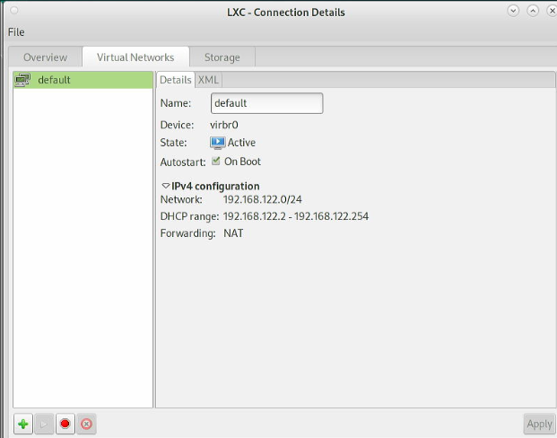

# x86_debian_virsh_lxc
Using virsh for managing lxc instances.    

Make sure the default network autostart at boot:    



### virsh lxc
Create lxc working directory:     

```
# mkdir LXC
# cd LXC && vim firstlxc.xml
```
content is listed as:     

```
<domain type='lxc' id='69980'>
  <name>firstlxc</name>
  <uuid>1511746e-6954-4a9c-b020-2187acfe50a8</uuid>
  <memory unit='KiB'>4276800</memory>
  <currentMemory unit='KiB'>4276800</currentMemory>
  <vcpu placement='static'>1</vcpu>
  <resource>
    <partition>/machine</partition>
  </resource>
  <os>
    <type arch='x86_64'>exe</type>
    <init>/lib/systemd/systemd</init>
  </os>
  <clock offset='utc'/>
  <on_poweroff>destroy</on_poweroff>
  <on_reboot>restart</on_reboot>
  <on_crash>destroy</on_crash>
  <devices>
    <emulator>/usr/lib/libvirt/libvirt_lxc</emulator>
    <filesystem type='mount' accessmode='passthrough'>
      <source dir='/var/lib/lxc/kylinlxc/rootfs'/>
      <target dir='/'/>
    </filesystem>
    <filesystem type='mount' accessmode='passthrough'>
      <source dir='/dev/snd'/>
      <target dir='/dev/snd'/>
    </filesystem>
    <filesystem type='mount' accessmode='passthrough'>
      <source dir='/dev/input'/>
      <target dir='/dev/input'/>
    </filesystem>
    <filesystem type='mount' accessmode='passthrough'>
      <source dir='/dev/dri'/>
      <target dir='/dev/dri'/>
    </filesystem>
    <interface type='network'>
      <mac address='52:54:00:5f:0b:a2'/>
      <source network='default' portid='bcbe29ad-69e4-4859-8339-b0fca5557368' bridge='virbr0'/>
      <target dev='vnet4'/>
      <guest dev='eth0'/>
    </interface>
    <console type='pty' tty='/dev/pts/3'>
      <source path='/dev/pts/3'/>
      <target type='lxc' port='0'/>
      <alias name='console0'/>
    </console>
    <hostdev mode='capabilities' type='misc'>
      <source>
        <char>/dev/dri/renderD128</char>
      </source>
    </hostdev>
    <hostdev mode='capabilities' type='misc'>
      <source>
        <char>/dev/fb0</char>
      </source>
    </hostdev>
    <hostdev mode='capabilities' type='misc'>
      <source>
        <char>/dev/tty8</char>
      </source>
    </hostdev>
    <hostdev mode='capabilities' type='misc'>
      <source>
        <char>/dev/tty0</char>
      </source>
    </hostdev>
    <hostdev mode='capabilities' type='misc'>
      <source>
        <char>/dev/dri/card0</char>
      </source>
    </hostdev>
    <hostdev mode='capabilities' type='misc'>
      <source>
        <char>/dev/input/event0</char>
      </source>
    </hostdev>
    <hostdev mode='capabilities' type='misc'>
      <source>
        <char>/dev/input/event1</char>
      </source>
    </hostdev>
    <hostdev mode='capabilities' type='misc'>
      <source>
        <char>/dev/input/event2</char>
      </source>
    </hostdev>
    <hostdev mode='capabilities' type='misc'>
      <source>
        <char>/dev/input/event3</char>
      </source>
    </hostdev>
    <hostdev mode='capabilities' type='misc'>
      <source>
        <char>/dev/input/event4</char>
      </source>
    </hostdev>
    <hostdev mode='capabilities' type='misc'>
      <source>
        <char>/dev/input/event5</char>
      </source>
    </hostdev>
    <hostdev mode='capabilities' type='misc'>
      <source>
        <char>/dev/input/event6</char>
      </source>
    </hostdev>
    <hostdev mode='capabilities' type='misc'>
      <source>
        <char>/dev/input/event7</char>
      </source>
    </hostdev>
    <hostdev mode='capabilities' type='misc'>
      <source>
        <char>/dev/input/event8</char>
      </source>
    </hostdev>
    <hostdev mode='capabilities' type='misc'>
      <source>
        <char>/dev/input/event9</char>
      </source>
    </hostdev>
    <hostdev mode='capabilities' type='misc'>
      <source>
        <char>/dev/input/event10</char>
      </source>
    </hostdev>
    <hostdev mode='capabilities' type='misc'>
      <source>
        <char>/dev/input/event11</char>
      </source>
    </hostdev>
    <hostdev mode='capabilities' type='misc'>
      <source>
        <char>/dev/snd/controlC0</char>
      </source>
    </hostdev>
    <hostdev mode='capabilities' type='misc'>
      <source>
        <char>/dev/snd/hwC0D0</char>
      </source>
    </hostdev>
    <hostdev mode='capabilities' type='misc'>
      <source>
        <char>/dev/snd/hwC0D2</char>
      </source>
    </hostdev>
    <hostdev mode='capabilities' type='misc'>
      <source>
        <char>/dev/snd/pcmC0D0c</char>
      </source>
    </hostdev>
    <hostdev mode='capabilities' type='misc'>
      <source>
        <char>/dev/snd/pcmC0D0p</char>
      </source>
    </hostdev>
    <hostdev mode='capabilities' type='misc'>
      <source>
        <char>/dev/snd/pcmC0D3p</char>
      </source>
    </hostdev>
    <hostdev mode='capabilities' type='misc'>
      <source>
        <char>/dev/snd/pcmC0D7p</char>
      </source>
    </hostdev>
    <hostdev mode='capabilities' type='misc'>
      <source>
        <char>/dev/snd/pcmC0D8p</char>
      </source>
    </hostdev>
    <hostdev mode='capabilities' type='misc'>
      <source>
        <char>/dev/snd/pcmC0D9p</char>
      </source>
    </hostdev>
    <hostdev mode='capabilities' type='misc'>
      <source>
        <char>/dev/snd/seq</char>
      </source>
    </hostdev>
    <hostdev mode='capabilities' type='misc'>
      <source>
        <char>/dev/snd/timer</char>
      </source>
    </hostdev>
  </devices>
</domain>
```
Define the lxc instance:     

```
# virsh -c lxc:/// define  firstlxc.xml
# virsh -c lxc:/// start firstlxc
```
The running result is the same as the manually created lxc instance.   
